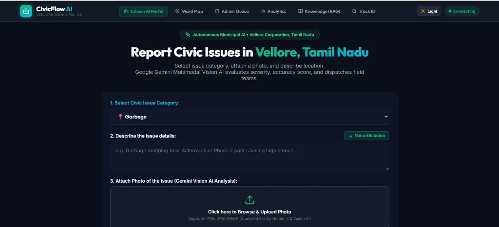
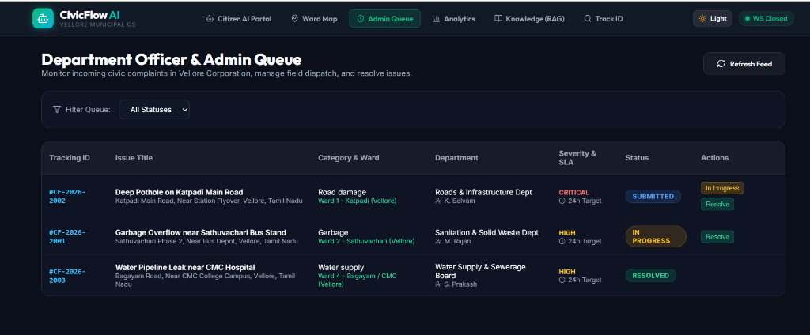
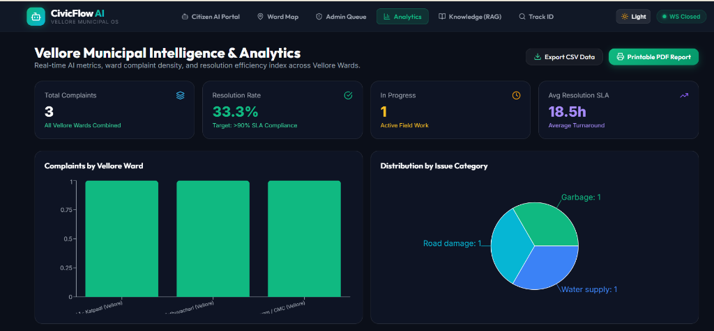

# CivicFlow AI 🏛️🤖

<div align="center">


### **Autonomous Municipal AI Operating System**
*Transforming Civic Grievance Management with Multi-Agent Intelligence, Gemini Vision, and Grounded RAG*

[](https://aistudio.google.com/)
[](https://react.dev/)
[](https://www.python.org/)
[](https://fastapi.tiangolo.com/)
[](https://ai.google.dev/)
[](https://github.com/google/adk)
[](https://www.trychroma.com/)
[](https://modelcontextprotocol.io/)
[](https://www.sqlite.org/)
[](https://tailwindcss.com/)
[](https://civic-flow-ai-six.vercel.app/)
[](https://drive.google.com/file/d/1VtOX-DWCmuTTR1iZ7ERY6RI3FBQtrqCR/view)
[](https://github.com/Prakashsuriya/CivicFlow-AI)

---

[📖 Documentation](./docs/overview.md) | [🏗️ Technical Architecture](./docs/architecture.md) | [🐝 Multi-Agent Swarm](./docs/agents.md) | [🔄 System Workflow](./docs/workflow.md) | [🔌 REST API Spec](./docs/api.md) | [🎬 Demo Script](./demo/demo.md) | [🚀 Deployment Guide](./docs/deployment.md)

</div>

---

## 🌟 Project Overview

**CivicFlow AI** is an autonomous, production-grade municipal AI operating system engineered for the **Google AI Agent Builder Series 2026 National Finale**.

Modern cities struggle with legacy complaint management systems that rely on manual dispatchers or rigid decision-tree chatbots. Citizens face multi-day delays, misplaced complaints, and zero visibility into resolution progress.

CivicFlow AI introduces an **8-agent multi-agent swarm** orchestrated by Google ADK / Gemini 2.5 Flash Vision. Citizens can report issues using natural language text, voice input, or photo attachments. The system autonomously inspects visual defects, geocodes municipal ward locations, queries official bylaws via ChromaDB RAG, routes work orders with SLA deadlines, dispatches notifications, and updates live city-wide analytics.

Default regional deployment target: **Vellore Corporation, Tamil Nadu** (covering Wards 1 to 5: Katpadi, Sathuvachari, Gandhinagar, Bagayam/CMC, and Fort Round).

---

## 🛑 Problem Statement vs. 💡 The CivicFlow AI Solution

| Legacy Municipal Process ❌ | CivicFlow AI Operating System ⚡ |
| :--- | :--- |
| **Manual Triage Delays:** Takes 3 to 7 days for paper or manual complaint routing. | **Sub-Second Automated Triage:** Multi-agent pipeline processes tickets instantly. |
| **Frustrating Static Chatbots:** Fail on unstructured queries or photo uploads. | **Multimodal Gemini Vision:** Inspects images, rates severity, and scores confidence. |
| **Hallucinated Answers:** Support agents give conflicting policy advice. | **Grounded ChromaDB RAG:** Retrieves grounded municipal bylaws and exact SLAs. |
| **Opaque Black Box:** Citizens have no visibility into internal processing. | **Live Reasoning Drawer:** Exposes real-time agent thoughts and sub-second tool calls. |
| **Duplicate Ticket Clutter:** Multiple reports of the same issue clog municipal queues. | **Semantic Duplicate Detection:** Automatically merges duplicates and increments priority. |

---

## ✨ Key Features & Capabilities

- **18 Supported Civic Categories:** Solid waste, Road damage, Streetlights, Water supply, Drainage, Illegal parking, Noise pollution, Air pollution, Flooding, Fallen trees, Dead animals, Traffic signals, Broken park equipment, Public toilets, Government welfare schemes, Emergency information, Health assistance, and Lost property.
- **Multimodal Visual Inspection:** Direct image upload evaluated live by Google Gemini 2.5 Flash Vision (`google-genai` SDK) with heuristic fallback resilience.
- **Autonomous Reasoning Drawer:** Interactive accordion component displaying real-time agent thoughts, selected tool parameters, and execution timing.
- **Interactive Ward Heatmap & Maps:** Powered by `Leaflet.js` and OpenStreetMap displaying complaint density markers across Vellore Corporation Wards.
- **Admin Officer Dashboard:** Municipal queue management with real-time WebSocket status lifecycle updates (`Submitted` ➔ `In Progress` ➔ `Resolved`).
- **Grounded Municipal RAG Search:** Instant vector search over official municipal policy handbooks and resolution SLA guidelines.

---

## 🐝 Multi-Agent Architecture (Google ADK)

CivicFlow AI is powered by **8 specialized AI agents** operating in a structured swarm:

```mermaid
graph TD
    subgraph Client Layer
        CitizenUI["Citizen Portal (React + Leaflet)"]
        AdminUI["Department Officer Dashboard (React + Recharts)"]
    end

    subgraph API Gateway
        FastAPI["FastAPI Gateway (/api/v1)"]
        WS["WebSocket Live Event Feed (/ws/feed)"]
    end

    subgraph Multi-Agent Orchestrator (Google ADK)
        Planner["🎯 1. Planner Agent (Lead Orchestrator)"]
        Vision["👁️ 2. Vision Agent (Gemini 2.5 Flash)"]
        Location["📍 3. Location Agent (Geocoder & Ward Map)"]
        Knowledge["📚 4. Knowledge Agent (ChromaDB RAG)"]
        Routing["🔀 5. Routing Agent (Department SLA Matrix)"]
        Complaint["📝 6. Complaint Agent (SQLite Lifecycle)"]
        Notification["🔔 7. Notification Agent (SMTP & WebSockets)"]
        Analytics["📊 8. Analytics Agent (KPIs & Heatmap)"]
    end

    subgraph Storage Layer
        SQLite[("SQLite Database (civicflow.db)")]
        ChromaDB[("ChromaDB Vector Store (chroma_db)")]
    end

    CitizenUI -->|Submit Report / Photo| FastAPI
    AdminUI -->|Manage Complaints / Status| FastAPI
    FastAPI --> Planner

    Planner --> Vision
    Planner --> Location
    Planner --> Knowledge
    Planner --> Routing
    Planner --> Complaint
    Planner --> Notification
    Planner --> Analytics

    Knowledge <--> ChromaDB
    Complaint <--> SQLite
    FastAPI --> WS
```

### Agent Roles Breakdown

1. **🎯 Planner Agent (Lead Orchestrator):** Manages end-to-end execution flow, logs sub-second step-by-step reasoning traces, and formats response summaries.
2. **👁️ Vision Agent (Google Gemini 2.5 Flash):** Inspects visual assets, extracts defect signatures, rates severity (`LOW`, `MEDIUM`, `HIGH`, `CRITICAL`), and calculates confidence scores (e.g. `96%`).
3. **📍 Location Agent:** Geocodes address strings and spatial coordinates into official municipal wards in Vellore, Tamil Nadu.
4. **📚 Knowledge Agent (ChromaDB Vector RAG):** Grounded search engine for municipal bylaws, resolution SLAs, and public welfare schemes.
5. **🔀 Routing Agent:** Automatically determines department jurisdiction (Sanitation, Roads, Water, Electrical, Parks, Traffic, Environment) and SLA targets.
6. **📝 Complaint Agent:** Generates unique tracking IDs (`#CF-2026-XXXX`), assigns ward field workers, and maintains database audit logs.
7. **🔔 Notification Agent:** Dispatches confirmation emails via SMTP and triggers WebSocket broadcasts.
8. **📊 Analytics Agent:** Computes city-wide resolution efficiency rates, category distributions, and ward density heatmaps.

> Detailed agent specs available in [docs/agents.md](./docs/agents.md).

---

## 🔄 System Workflow & Complaint Lifecycle

```
[Citizen Report] ➔ [1. Planner] ➔ [2. Vision AI] ➔ [3. Location Ward] 
                       │
                       ▼
[8. Analytics Sync] ◄─ [7. Notifications] ◄─ [6. Complaint DB] ◄─ [5. Routing] ◄─ [4. RAG Policy Search]
                                                                        │
                                                                        ▼
                                                             [Duplicate Detection Check]
```

1. **Submission:** Citizen uploads text, voice, or photo.
2. **AI Inspection & Ward Mapping:** Gemini Vision evaluates image; Location Agent assigns ward (`Ward 2 - Sathuvachari`).
3. **Policy Grounding & Routing:** ChromaDB RAG retrieves SLA rules; Routing Agent assigns department (`Roads & Infrastructure`, SLA: 24h).
4. **Duplicate Detection:** Checks active tickets in the same ward to prevent ticket clogging.
5. **Registration & Alert:** Ticket `#CF-2026-XXXX` created in SQLite, email dispatched, and WebSocket event broadcasted.
6. **Resolution:** Municipal officer updates status (`Submitted` ➔ `In Progress` ➔ `Resolved`).

> Full workflow details available in [docs/workflow.md](./docs/workflow.md).

---

## 🖼️ Screenshots Showcase

| Citizen Portal & Reasoning Drawer | Admin Officer Dashboard |
| :---: | :---: |
|  |  |

| City-Wide Analytics & Ward Map | System Architecture Topology |
| :---: | :---: |
|  |  |

> Additional visual assets available in [screenshots/](./screenshots/README.md).

---

## 🛠️ Technology Stack

| Layer | Technology |
| :--- | :--- |
| **Frontend UI** | React 18, Vite, Custom HSL Design System, Leaflet.js, Recharts, Lucide Icons |
| **Backend Gateway** | FastAPI, Uvicorn, Python 3.10+, Pydantic |
| **AI Framework** | Google ADK Architecture, Google Gemini 2.5 Flash Vision (`google-genai` SDK) |
| **Vector DB & RAG** | ChromaDB Persistent Vector Storage, SentenceTransformers |
| **Database & ORM** | SQLite, SQLAlchemy ORM |
| **Inter-Agent Protocol** | Model Context Protocol (MCP) Tool Bindings |
| **Real-Time Feed** | WebSockets (`ws.py`), Python SMTP Mailer |

---

## 🚀 Getting Started & Local Installation Guide

### Prerequisites
- Python 3.10 or higher
- Node.js 18.x or higher and npm
- Git

### 1. Clone the Repository

```bash
git clone https://github.com/Prakashsuriya/CivicFlow-AI.git
cd CivicFlow-AI
```

### 2. Configure Environment Variables

Copy `.env.example` to `.env`:

```bash
cp .env.example .env
```

Set your API key in `.env`:
```env
GEMINI_API_KEY=your_gemini_api_key_here
```

### 3. Backend Setup (FastAPI + ChromaDB)

```bash
cd backend

# Create & activate virtual environment
python -m venv venv
source venv/bin/activate  # Linux/macOS
# venv\Scripts\activate   # Windows

# Install Python dependencies
pip install -r requirements.txt

# Initialize Database & Seed Wards/Workers
python -m app.database.init_db

# Ingest Municipal Policy Documents into ChromaDB
python -m app.rag.ingest

# Start FastAPI Backend Server
python -m uvicorn app.main:app --reload --port 8000
```
> FastAPI Swagger Documentation will be live at: **http://localhost:8000/docs**

### 4. Frontend Setup (React + Vite)

Open a new terminal window:

```bash
cd frontend

# Install Node dependencies
npm install

# Start Vite Development Server
npm run dev
```
> Web Application will be live at: **http://localhost:5173**

---

## 📂 Professional Project Directory Structure

```
CivicFlow-AI/
├── architecture/                 # Architecture Assets & PRD Document
│   ├── architecture-diagram.png  # System Micro-Architecture Visual
│   ├── architecture.pdf          # PDF System Architecture Topology
│   └── PRD.md                    # Product Requirements Document
│
├── docs/                         # Comprehensive Documentation Suite
│   ├── overview.md               # System Overview & Value Proposition
│   ├── architecture.md           # Deep-Dive Technical Architecture Spec
│   ├── workflow.md               # End-to-End Complaint Lifecycle Guide
│   ├── api.md                    # REST API & WebSocket OpenAPI Spec
│   ├── deployment.md             # Production Deployment (Docker/Vercel)
│   └── agents.md                 # 8-Agent Swarm Detailed Specification
│
├── screenshots/                  # UI Visual Showcase & Assets
│   ├── README.md
│   ├── citizen-portal.png
│   ├── admin-dashboard.png
│   └── analytics-page.png
│
├── demo/                         # Evaluator Demo Suite
│   ├── demo.md                   # Interactive Test Script & Guide
│   └── demo-video.md             # Video Showcase Link & Script
│
├── backend/                      # FastAPI Backend & Multi-Agent Engine
│   ├── app/
│   │   ├── agents/               # 8 Autonomous AI Agent Specifications
│   │   │   ├── base.py           # BaseAgent Specification
│   │   │   ├── planner_agent.py  # 🎯 Chief Autonomous Orchestrator
│   │   │   ├── vision_agent.py   # 👁️ Gemini 2.5 Flash Vision Agent
│   │   │   ├── location_agent.py # 📍 Geocoder & Ward Identifier
│   │   │   ├── knowledge_agent.py# 📚 ChromaDB RAG Search Agent
│   │   │   ├── routing_agent.py  # 🔀 Department & SLA Classifier
│   │   │   ├── complaint_agent.py# 📝 SQLite CRUD & Audit Agent
│   │   │   ├── notification_agent.py # 🔔 SMTP & WebSocket Dispatcher
│   │   │   └── analytics_agent.py# 📊 Heatmap & Metrics Specialist
│   │   ├── api/v1/               # REST API Routers & Endpoints
│   │   ├── database/             # SQLAlchemy Models & Seed Data
│   │   ├── rag/                  # ChromaDB Vector Search Engine & Docs
│   │   ├── tools/                # Agent Tool Bindings (MCP Compliant)
│   │   ├── utils/                # Logging & WebSocket Connection Manager
│   │   ├── config.py             # System Settings & Environment Variables
│   │   └── main.py               # FastAPI App Entrypoint
│   ├── .env.example
│   ├── requirements.txt
│   └── test_agent.py             # Pipeline Integration Test Script
│
├── frontend/                     # React 18 + Vite Web Application
│   ├── src/
│   │   ├── components/           # Navbar, Map, Reasoning Drawer
│   │   ├── pages/                # Citizen, Admin, Analytics, Knowledge, Track
│   │   ├── services/             # Axios API Client & WebSockets
│   │   ├── App.jsx
│   │   ├── index.css             # Custom HSL Design System
│   │   └── main.jsx
│   ├── index.html
│   ├── package.json
│   └── vite.config.js
│
├── .env.example                  # Root Environment Variables Template
├── LICENSE                       # MIT License File
├── PROJECT_REVIEW.md             # Architecture Audit & Readiness Report
└── README.md                     # World-Class Repository Documentation
```

---

## 🔌 API Endpoints Summary

| Method | Endpoint | Description |
| :--- | :--- | :--- |
| `POST` | `/api/v1/complaints/submit` | Submit civic report to 8-agent pipeline. |
| `GET` | `/api/v1/complaints/` | Fetch filtered complaint list (by status/ward/category). |
| `GET` | `/api/v1/complaints/{id}` | Fetch complaint details, image metadata, and status log trail. |
| `PUT` | `/api/v1/complaints/{id}/status` | Update resolution status (`Submitted` ➔ `In Progress` ➔ `Resolved`). |
| `GET` | `/api/v1/analytics/dashboard` | Get real-time city-wide resolution KPIs and ward distribution. |
| `GET` | `/api/v1/analytics/heatmap` | Get ward density coordinates for Leaflet heat maps. |
| `POST` | `/api/v1/rag/search` | Query ChromaDB vector database for municipal bylaws. |
| `WS` | `/ws/feed` | WebSocket live event feed for real-time dashboard updates. |

> Complete OpenAPI spec with request/response schemas available in [docs/api.md](./docs/api.md).

---

## 🔮 Future Scope & Roadmap

- **PostGIS Integration:** Upgrade SQLite spatial queries to native PostGIS geospatial polygon intersections.
- **Offline Field Worker Mobile PWA:** React Native progressive web app for field workers to update work orders offline.
- **Multilingual Voice AI:** Support real-time Tamil, Hindi, and Telugu speech-to-text translation.
- **IoT Smart City Integration:** Directly hook smart garbage bin fill sensors into the Planner Agent execution queue.

---

## 🤝 Contributing

Contributions are welcome! Please follow these steps:
1. Fork the repository.
2. Create your feature branch (`git checkout -b feature/AmazingFeature`).
3. Commit your changes (`git commit -m 'Add some AmazingFeature'`).
4. Push to the branch (`git push origin feature/AmazingFeature`).
5. Open a Pull Request.

---

## 📜 License & Acknowledgments

Distributed under the **MIT License**. See [`LICENSE`](./LICENSE) for details.

Built with ❤️ for the **Google AI Agent Builder Series 2026 National Finale**.

- **Author:** Prakash Suriya
- **GitHub:** [@Prakashsuriya](https://github.com/Prakashsuriya)
- **Repository:** [CivicFlow-AI](https://github.com/Prakashsuriya/CivicFlow-AI)
