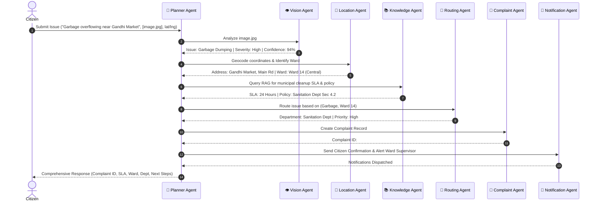
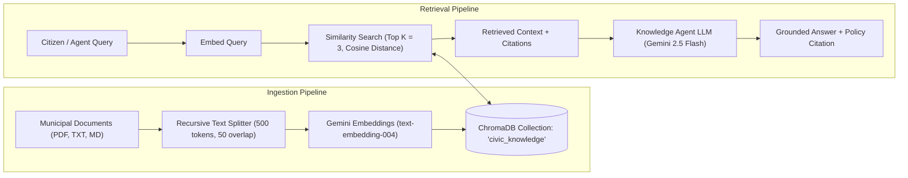
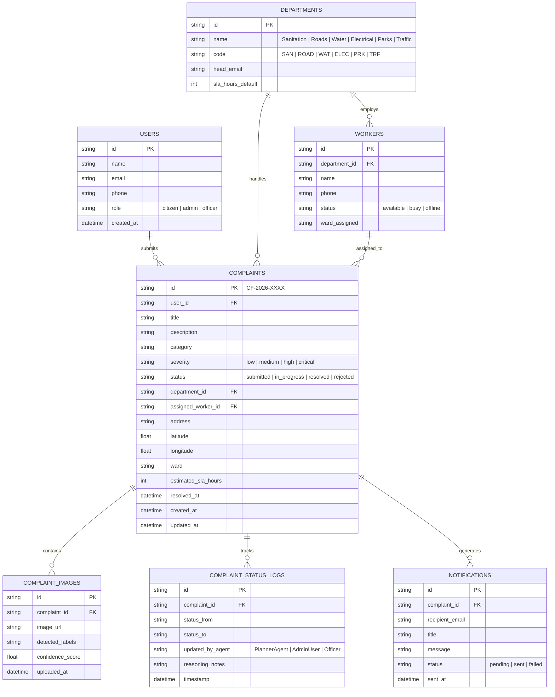

# Phase 1: CivicFlow AI - System Architecture & High-Level Design

**CivicFlow AI** is an autonomous municipal AI operating system engineered for citizens, municipal officers, field workers, and administrators. Built for the Google AI Agent Builder Series 2026, it replaces static chatbots with an autonomous, multi-agent AI system capable of reasoning, planning, vision analysis, document retrieval (RAG), tool selection, dynamic routing, database management, and real-time citizen notification.

---

## 1. Technology Decisions & Rationale

| Layer | Technology | Rationale & Utility |
| :--- | :--- | :--- |
| **Frontend** | React + Vite + Vanilla CSS / Tailwind CSS | Fast HMR development, modern component state management, responsive micro-animations, interactive maps with Leaflet/OpenStreetMap, dark mode support. |
| **Backend API** | FastAPI (Python 3.11+) | Async I/O for concurrent agent calls, native OpenAPI/Swagger docs, high throughput, easy integration with Python AI packages. |
| **Agent Framework** | Google Agent Development Kit (ADK) + Gemini 2.5/3.0 | Native support for multi-agent delegation, structured tool calling, memory management, and high-reasoning execution loops. |
| **Vector DB (RAG)** | ChromaDB + Gemini Embeddings (`text-embedding-004`) | Local zero-cost vector storage for municipal rulebooks, citizen rights, emergency contacts, policies, and municipal handbook RAG pipeline. |
| **Database** | SQLite + SQLAlchemy ORM | Lightweight, zero-config relational database storing users, complaints, departments, status logs, audit traces, workers, and analytics. |
| **Maps & Geo** | Leaflet.js + OpenStreetMap (OSM Nominatim) | Interactive map UI, forward/reverse geocoding, pin positioning, and ward location detection. |
| **MCP Integration** | Model Context Protocol (MCP) Python SDK | Standardized interface for agents to securely access Filesystem, SQLite, OpenStreetMap geocoder, Email/Notifications, and Browser tools. |

---

## 2. System Architecture & High-Level Design

```mermaid
graph TD
    subgraph Client Layer
        CitizenUI["Citizen Portal (React + Leaflet)"]
        AdminUI["Admin & Dept Dashboard (React + Recharts)"]
    end

    subgraph API Gateway Layer
        FastAPI["FastAPI Gateway (/api/v1)"]
        WS["WebSocket Server (Real-time Live Feed)"]
    end

    subgraph Multi-Agent Orchestrator (Google ADK)
        Planner["🎯 Planner Agent (ADK Lead)"]
        Vision["👁️ Vision Agent (Gemini Vision)"]
        Knowledge["📚 Knowledge Agent (ChromaDB RAG)"]
        Location["📍 Location Agent (OSM / Geocoder)"]
        Routing["🔀 Routing Agent (Rules & AI Classifier)"]
        Complaint["📝 Complaint Agent (CRUD & Lifecycle)"]
        Notification["🔔 Notification Agent (Email / WebSocket)"]
        Analytics["📊 Analytics Agent (KPIs & Trends)"]
    end

    subgraph Storage & Context Layer
        SQLite[("SQLite Database")]
        ChromaDB[("ChromaDB Vector Store")]
        MCPServers["MCP Servers (Filesystem, SQLite, Geocoder, Mail)"]
    end

    CitizenUI -->|REST / Form Data / Images| FastAPI
    AdminUI -->|REST / Analytics| FastAPI
    FastAPI -->|Delegate Request| Planner

    Planner -->|Image Analysis| Vision
    Planner -->|Query Municipal Rules| Knowledge
    Planner -->|Geocode Coordinates| Location
    Planner -->|Determine Dept| Routing
    Planner -->|Persist & Update| Complaint
    Planner -->|Alert Stakeholders| Notification
    Planner -->|Aggregate Metrics| Analytics

    Knowledge <--> ChromaDB
    Complaint <--> SQLite
    Location <--> MCPServers
    Complaint <--> MCPServers

    FastAPI -->|Push Updates| WS
    WS --> Client Layer
```

---

## 3. Multi-Agent Architecture (Google ADK Definitions)

Each agent in CivicFlow AI is implemented as a specialized Google ADK agent instance configured with systemic system instructions, tools, and output schemas.



### Agent Roles & Specifications

1. **Planner Agent (Orchestrator)**
   - **Role:** Central commander. Parses raw citizen inputs (text, voice transcript, image URL, coordinates), creates execution plan, invokes child agents sequentially or in parallel, synthesizes agent outputs into a clear response with reasoning steps.
   - **ADK Capabilities:** Multi-agent delegation, workflow state machine, error recovery.

2. **Vision Agent**
   - **Role:** Multi-modal analysis using Gemini Vision. Detects civic issues from photos (potholes, garbage dumping, broken streetlights, water leaks, tree falls, flooding, traffic signal failure). Outputs bounding labels, severity estimation (Low/Medium/High/Critical), and descriptive summary.
   - **Tools:** Image preprocessing, Gemini multi-modal prompt runner.

3. **Knowledge Agent (RAG)**
   - **Role:** Queries ChromaDB for municipal regulations, SLA timelines, emergency phone numbers, citizen rights, and government welfare schemes. Ensures zero hallucination by returning strict context citations.
   - **Tools:** `vector_search_tool`, `document_retrieval_tool`.

4. **Location Agent**
   - **Role:** Normalizes address data, performs reverse geocoding via OpenStreetMap Nominatim, maps latitude/longitude to official municipal ward boundaries, and identifies nearby city landmarks.
   - **Tools:** `reverse_geocode_tool`, `ward_lookup_tool`.

5. **Routing Agent**
   - **Role:** Maps issue categories and severity to municipal departments (Sanitation, Roads, Water Supply, Electrical, Parks & Recreation, Traffic, Public Health). Determines department SLA and auto-assigns relevant field supervisors.
   - **Tools:** `department_routing_matrix_tool`.

6. **Complaint Agent**
   - **Role:** Manages full complaint lifecycle (Create, Read, Update, Delete status, Assign worker, Resolution timestamp, Audit log creation). Generates unique tracking IDs (`CF-YYYY-XXXX`).
   - **Tools:** `create_complaint_tool`, `update_status_tool`, `add_audit_log_tool`.

7. **Notification Agent**
   - **Role:** Dispatches real-time updates via WebSockets to Admin Dashboards and generates email/SMS summary notifications for citizens and field officers.
   - **Tools:** `send_email_notification`, `push_websocket_event`.

8. **Analytics Agent**
   - **Role:** Computes spatial and temporal metrics across all municipal complaints: resolution time per ward, heatmap dataset, pending vs resolved ratios, and department performance index.
   - **Tools:** `aggregate_complaints_tool`, `generate_ward_heatmap_tool`.

---

## 4. MCP (Model Context Protocol) Integration Matrix

CivicFlow AI utilizes MCP servers to give agents safe, standardized tool primitives:

| MCP Server | Used By Agent | Description / Purpose |
| :--- | :--- | :--- |
| **`mcp-server-sqlite`** | Complaint Agent, Analytics Agent | Directly queries and updates the database schema safely with parameter binding. |
| **`mcp-server-filesystem`** | Vision Agent, Knowledge Agent | Reads uploaded image files and retrieves RAG source PDFs/handbooks from disk. |
| **`mcp-server-openstreetmap`** | Location Agent | Executes forward and reverse geocoding queries against OpenStreetMap APIs. |
| **`mcp-server-email`** | Notification Agent | Formats and sends HTML confirmation emails to citizens and municipal staff. |
| **`mcp-server-browser`** | Knowledge Agent | Verifies external government portal announcements when local vector store lacks specific scheme details. |

---

## 5. RAG Pipeline Architecture (ChromaDB)



### Knowledge Base Content:
- Municipal By-laws & Penalty Guidelines
- Department SLA Agreements (e.g., Garbage cleanup: 24h, Potholes: 72h, Streetlight: 48h)
- Public Welfare Schemes & Eligibility Rules
- Emergency Contact Rosters & Disaster Management Guidelines

---

## 6. Database Schema & ER Diagram



---

## 7. Folder Structure Specification

```
CivicFlow AI/
├── backend/
│   ├── app/
│   │   ├── __init__.py
│   │   ├── main.py                 # FastAPI Entry point & WebSockets
│   │   ├── config.py               # Environment & App Settings
│   │   ├── api/
│   │   │   ├── __init__.py
│   │   │   ├── v1/
│   │   │   │   ├── __init__.py
│   │   │   │   ├── router.py       # API v1 Router inclusion
│   │   │   │   ├── complaints.py   # Complaint CRUD & Image submit
│   │   │   │   ├── analytics.py    # Heatmap & Department KPIs
│   │   │   │   ├── rag.py          # Knowledge base query endpoint
│   │   │   │   └── admin.py        # Status updates & Worker assignment
│   │   ├── agents/                 # Google ADK Agents
│   │   │   ├── __init__.py
│   │   │   ├── base.py             # ADK Base Agent class & runner
│   │   │   ├── planner_agent.py    # Chief Orchestrator
│   │   │   ├── vision_agent.py     # Gemini Multi-modal issue detection
│   │   │   ├── knowledge_agent.py  # ChromaDB RAG Agent
│   │   │   ├── routing_agent.py    # Department Matrix Agent
│   │   │   ├── location_agent.py   # Geocoding & Ward Identifier
│   │   │   ├── complaint_agent.py  # Lifecycle & DB Agent
│   │   │   ├── notification_agent.py # Mail & WS dispatch
│   │   │   └── analytics_agent.py  # KPI & Trend Generation
│   │   ├── database/
│   │   │   ├── __init__.py
│   │   │   ├── connection.py       # SQLAlchemy Session engine
│   │   │   ├── models.py           # DB Models (User, Complaint, etc.)
│   │   │   └── init_db.py          # Seed data generator (Depts, Workers)
│   │   ├── mcp/
│   │   │   ├── __init__.py
│   │   │   ├── client.py           # MCP Client wrapper
│   │   │   └── servers/            # Custom MCP tools binding
│   │   ├── rag/
│   │   │   ├── __init__.py
│   │   │   ├── ingest.py           # Ingestion script for municipal docs
│   │   │   ├── retriever.py        # Vector search wrapper
│   │   │   └── docs/               # Source municipal rulebooks (PDF/MD)
│   │   ├── tools/                  # Function calling definitions for ADK
│   │   │   ├── __init__.py
│   │   │   ├── vision_tools.py
│   │   │   ├── geo_tools.py
│   │   │   ├── db_tools.py
│   │   │   └── rag_tools.py
│   │   └── utils/
│   │       ├── __init__.py
│   │       └── logger.py
│   ├── tests/                      # Pytest suite
│   ├── pyproject.toml
│   └── requirements.txt
│
└── frontend/
    ├── public/
    │   └── favicon.ico
    ├── src/
    │   ├── assets/
    │   ├── components/
    │   │   ├── Navbar.jsx
    │   │   ├── Sidebar.jsx
    │   │   ├── ChatInterface.jsx   # Autonomous Reasoning Chat UI
    │   │   ├── IssueUploader.jsx   # Image + Location Dropzone
    │   │   ├── InteractiveMap.jsx  # Leaflet Ward Heatmap & Pins
    │   │   ├── ComplaintCard.jsx   # Status tracker card
    │   │   ├── ReasoningDrawer.jsx # Accordion showing Agent Thought Process
    │   │   ├── AdminTable.jsx      # Department complaint queue
    │   │   └── StatCards.jsx       # Analytics numbers
    │   ├── pages/
    │   │   ├── CitizenPortal.jsx   # Main Citizen Page
    │   │   ├── TrackComplaint.jsx  # Lookup complaint by ID
    │   │   ├── AdminDashboard.jsx  # Department Officer Dashboard
    │   │   ├── AnalyticsPage.jsx   # Heatmap & Performance Charts
    │   │   └── KnowledgePage.jsx   # RAG Municipal Rule search
    │   ├── services/
    │   │   ├── api.js              # Axios REST Client
    │   │   └── websocket.js        # Live Feed WS connection
    │   ├── context/
    │   │   └── AuthContext.jsx
    │   ├── App.jsx
    │   ├── index.css               # Design System & Tailwind base
    │   └── main.jsx
    ├── index.html
    ├── package.json
    ├── vite.config.js
    └── tailwind.config.js
```

---

## 8. Implementation Roadmap (Phases)

- **Phase 1 (Current):** System Architecture, Agent Blueprint, Database ERD & Folder Structure (User Approval Required).
- **Phase 2:** Backend Infrastructure, Database Initialization (SQLAlchemy), Seeding, and Core FastAPI Endpoints.
- **Phase 3:** Google ADK Multi-Agent System (Planner, Vision, Knowledge, Routing, Location, Complaint, Notification, Analytics) + MCP Server Integration.
- **Phase 4:** ChromaDB RAG Vector Store & Municipal Ingestion Engine.
- **Phase 5:** Premium Frontend Development (React + Vite + Leaflet Maps + Real-time Agent Reasoning Visualization Drawer + Admin/Citizen Portals).
- **Phase 6:** End-to-End Autonomous Demo Flow, Live Testing, Verification & Final Documentation.

---

## User Review & Approval Required

> [!IMPORTANT]
> **Key Decision Points for User Approval:**
> 1. **Multi-Agent Flow:** The Planner Agent orchestrates Vision, Location, Knowledge, Routing, Complaint, Notification, and Analytics agents.
> 2. **RAG Vector Storage:** ChromaDB will ingest sample municipal handbooks and citizen guidelines using `text-embedding-004`.
> 3. **Database Schema:** SQLite with SQLAlchemy ORM covering Users, Complaints, Departments, Workers, Images, Status Logs, and Notifications.
> 4. **Live Execution Mode:** We will build a complete hackathon-ready workspace with fully working backend, frontend, vector store, and mock seed data for an impressive live demo.

Please review the architectural specification above. Once approved, we will proceed immediately to **Phase 2** (Backend & Database Foundation).
