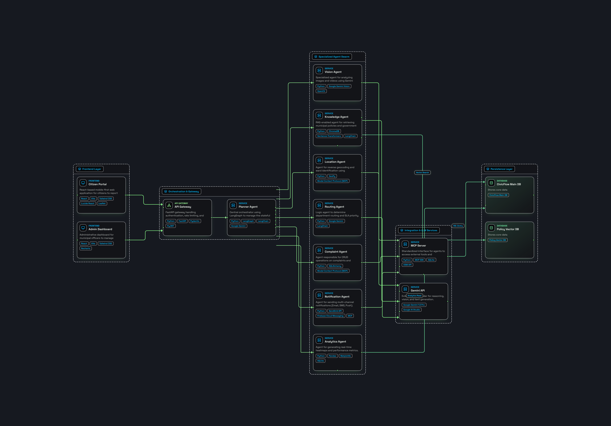

# CivicFlow AI - Screenshots & Visual Showcase 📸

> **Visual Interface Showcase for Google AI Agent Builder Series 2026 National Finale.**

---

## 🖼️ Application Interfaces

### 1. System Architecture Diagram

*Complete micro-architecture detailing Frontend, API Gateway, 8-Agent Swarm (Google ADK), Gemini 2.5 Vision, ChromaDB RAG, and SQLite Database.*

---

### 2. Citizen AI Portal Page

*Interactive Citizen Portal featuring 18 civic complaint categories, real photo drag-and-drop attachment, voice prompt support, and live Autonomous Reasoning Drawer.*

---

### 3. Municipal Admin & Officer Dashboard

*Departmental complaint queue for municipal officers to assign field workers, review visual inspection notes, and update complaint status lifecycle (`Submitted` ➔ `In Progress` ➔ `Resolved`).*

---

### 4. City-Wide Analytics & Ward Heatmap

*Executive dashboard rendering resolution speed indexes, ward density heatmaps via Leaflet.js, and category distribution charts via Recharts.*

---

*Note: You can replace screenshot placeholder images in this folder with high-resolution direct captures of your local running instance.*
